# get-rich

**Helps you quickly get rich text into your console printing.**  


<p align="left">
  <a href="https://clojars.org/io.github.paintparty/get-rich">
    </img>
  </a>
</p>

<br>

<p align="center">
  
</p>

## Features

- Works great for both Clojure and ClojureScript.

- Supports both terminal emulators and browser consoles.

- Simple, accessibility-focused, 7-color pallette.

- All colors provide reasonable contrast on both light and dark backgrounds.

- Simple and intuitive hiccup-like markup syntax.

- Sensible templates for callouts such as errors, warnings, success, etc.


<br>

## Setup


Add as a dependency to your project:


```Clojure
[io.github.paintparty/get-rich "0.1.0"]
```
<br>

Import into your namespace:

```Clojure
(ns myns.core
  (:require
    [get-rich.core :refer [enriched callout point-of-interest]]))

;; In ClojureScript, you may also want :refer get-rich.core/print-enriched.
```

<br>

## Basic Usage 

Note that if you are reading this on github in a light-mode theme, the dark-mode samples in the sections below will appear to have lower contrast than they actually do if you were viewing them in dark-mode. 

**`get-rich.core/enriched`** takes any number of arguments and returns a string
of text decorated with tags for colorization, italics, and boldness:

```Clojure
(println (enriched [:bold "bold"]
                   ", "
                   [:italic "italic"]
                   ", or "
                   [:blue "colored"]))
```
<p align="center">
  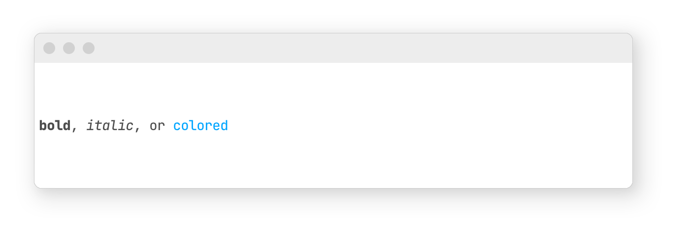
</p>

</p>

<p align="center">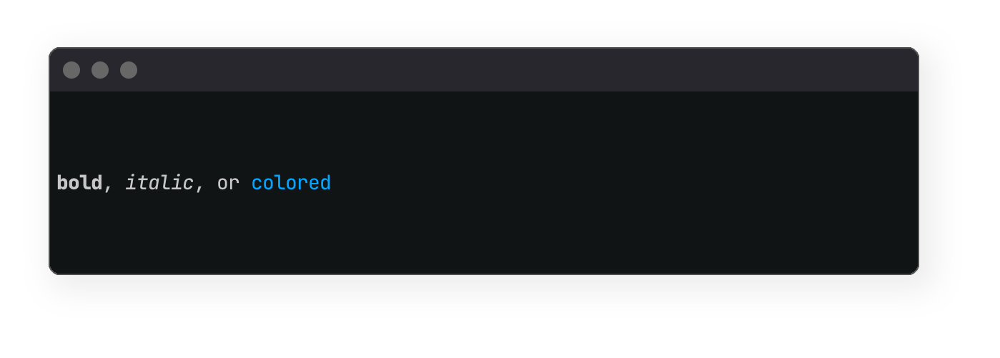</p>


<br>

In ClojureScript, **`enriched`** returns a js array that needs to be printed like this: <br>
`(.apply js/console.log js/console returned-array)`.<br>

To avoid typing all this out, you can use **`get-rich.core/print-enriched`** to print the array returned from **`enriched`**:

```Clojure
(print-enriched (enriched [:bold "bold"]
                          ", "
                          [:italic "italic"]
                          ", or "
                          [:blue "colored"]))
```

By default, in ClojureScript, **`get-rich.core/print-enriched`** prints with `js/console.log`.
However, if you would like to print with either `js.console/warn`, or `js/console.error`, you can pass either as a second argument.

```Clojure
(print-enriched (enriched [:bold "bold"]
                          ", "
                          [:italic "italic"]
                          ", or "
                          [:blue "colored"])
                js/console.warn)
```
<br>

### Combo styles

You can add multiple decorations with hiccup-style tags (a keyword with dot separators). The order of the things separated by dots doesn't matter.
```Clojure
(println (enriched [:bold.italic "bold & italic"]
                   ", "
                   [:italic.blue "italic & colored"]
                   ", "
                   [:bold.italic.white.blue-bg "bold & italic & colored & colored-bg"]))
```
<p align="center">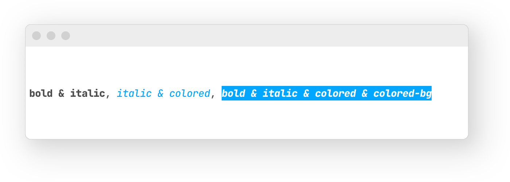</p>
<p align="center">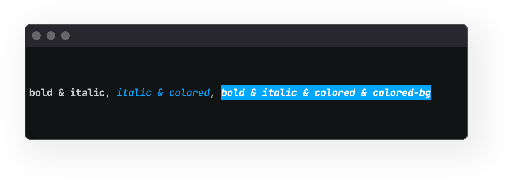</p>

<br>


### The get-rich pallette 

Seven carefully selected colors, from the [xterm range 16-255](https://en.m.wikipedia.org/wiki/Xterm#/media/File%3AXterm_256color_chart.svg), are available for use (shown in bold). All of these colors should display consistantly across most consoles on the end-user side. Don't expect all of the colors to pass the [strictest APCA contrast criterion](https://www.myndex.com/APCA/), but you can be sure that they will be reasonably visible on both light and dark backgrounds:

```Clojure
(println (enriched [:bold.red "Red"]
                   ", "
                   [:bold.yellow "Yellow"]
                   ", "
                   [:bold.green "Green"]
                   ", "
                   [:bold.blue "Blue"]
                   ", "
                   [:bold.purple "Purple"]
                   ", "
                   [:bold.magenta "Magenta"]
                   ", "
                   [:bold.gray "Gray"]
                   ", "
                   [:bold.black "Black"]
                   ", "
                   [:bold.white "White"] ))
```
<p align="center">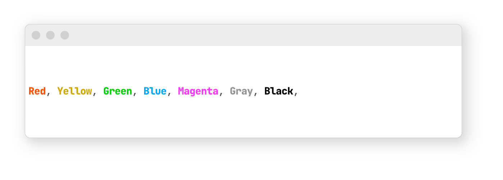</p>
<p align="center"></p>

<br>

### Color aliases

You can use the following semantic aliases for some colors (shown in bold):
```Clojure
(println (enriched [:bold.negative "Negative"]
                   ", "
                   [:bold.error "Error"]
                   ", "
                   [:bold.warning "Warning"]
                   ", "
                   [:bold.positive "Positive"]
                   ", "
                   [:bold.info "Info"]
                   ", "
                   [:bold.subtle "Subtle"]
                   ", "
                   [:bold.neutral "Neutral"] ))
```
<br>

<p align="center">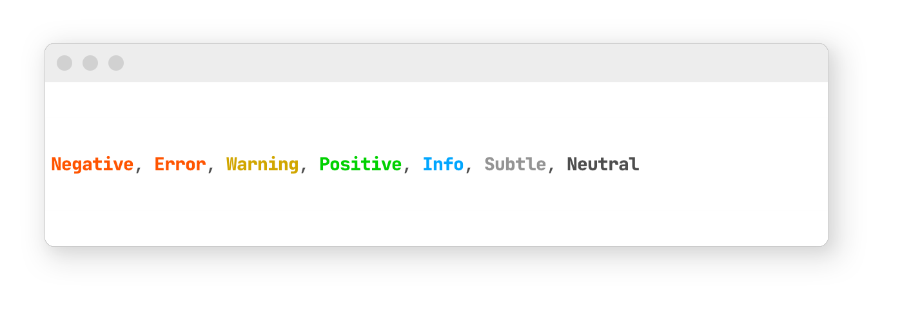</p>
<p align="center">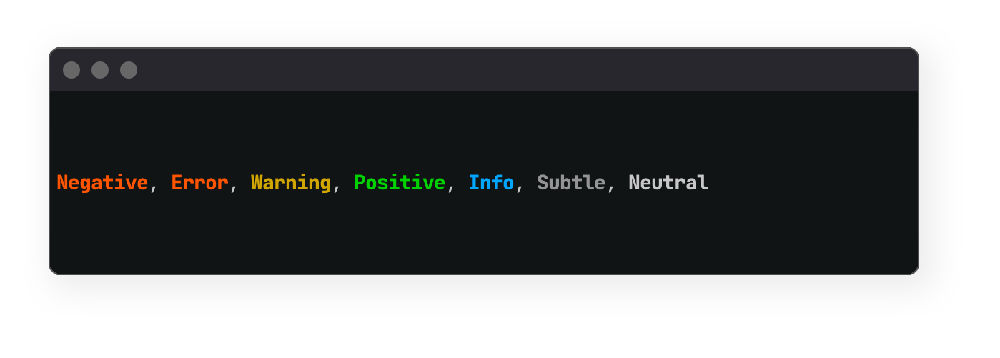</p>

<br>


You can also pass a map (instead of a hiccup-style tag) to style the text:
```Clojure
(enriched [{:color            :green
            :background-color :black
            :font-style       :italic
            :font-weight      :bold}
           "Negative"])
```
<br>

Note that all the arguments to **`get-rich.core/enriched`** must satisfy this predicate:
```Clojure
(every? (fn [x]
          (or (and (vector? x)
                   (= 2 (count x))
                   (-> x
                       (nth 0)
                       (maybe #(or (keyword? %)
                                   (map? %)))))
              (not (coll? x))))
        args)
```

In other words, every one of the arguments to **`get-rich.core/enriched`** must be either:<br>
- A two-element vector, with the first element being a keyword or map.<br>
- A value which is not a collection.

If you want to print `[1 2 3]` in red, you will need to stringify the vector:
```Clojure
(enriched [:red (str [1 2 3])])
```

<br>
<br>

## Printing formatted blocks to the console
**`get-rich.core/callout`** will print a message "block" to the console with a colored bounding border in the inline-start position:

<!-- ;; Add success case to these -->

```Clojure
(callout {:type :info}
         "Example callout, with :type of :info")

(callout {:type  :info
          :label "My custom label"}
         "Example callout, with :type of :info and custom :label")

(callout {:type :warning}
         "Example callout, with :type of :warning")

(callout {:type :error}
         "Example callout, with :type of :error")

(callout {:type :positive
          :label      "SUCCESS!"}
         "Example callout, with :type of :positive, and custom :label")

(callout {:type :subtle}
         "Example callout, with :type of :subtle (or :gray)")

(callout {:type :magenta}
         "Example callout, with :type of :magenta")

(callout {:type :purple}
         "Example callout, with :type of :purple")

(callout "Example callout, default")
```

<br>

The above calls would render the following in your favorite terminal emulator: 

<p align="center">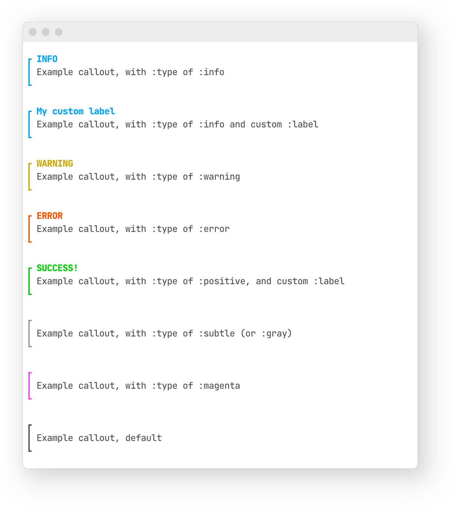</p>

<p align="center">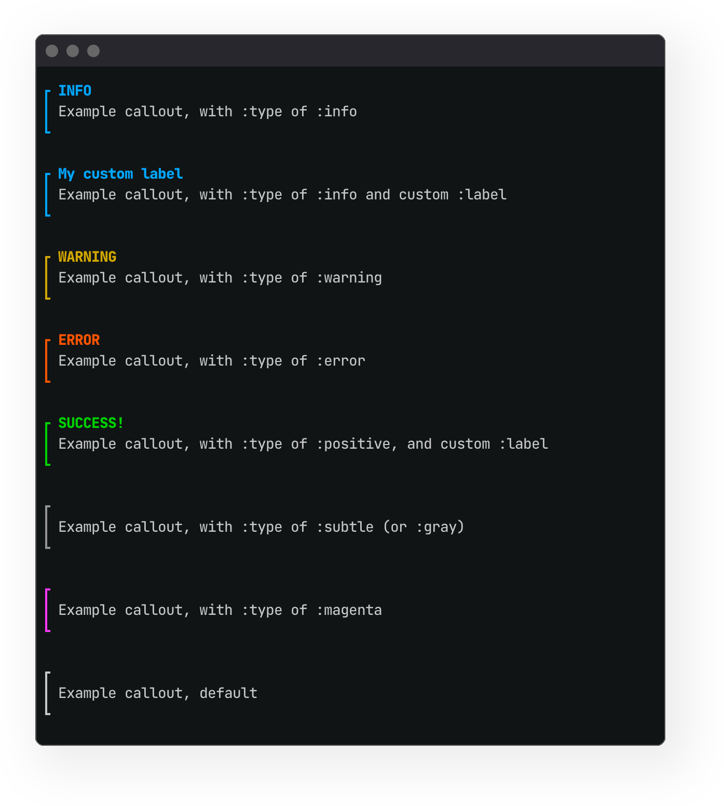</p>

<br>
<br>

## Templates for errors and warnings

**`get-rich.core/callout`**, paired with **`get-rich.core/point-of-interest`** is perfect for creating your own custom error or warning messages. **`get-rich.core/point-of-interest`** takes a single map with the following options:

| Option    | Type              | Description                                                  |
| :-------- | ----------------- | ------------------------------------------------------------ |
| `:file`   | string            | File or namespace                                            |
| `:line`   | integer           | line number                                                  |
| `:column` | integer           | column number                                                |
| `:form`   | any               | The form to draw attention to<br />Automatically truncated at 33 chars |
| `:type`   | keyword or string | Controls the color of the squiggly underline.<br />Should be one of: `:error` `:warning`, or `:neutral`.<br />Defaults to `:neutral` |
| `:header` | string or vector  | Any number of lines of text at the start of the block        |
| `:body`   | string or vector  | Any numbe of lines of text at the end of the block           |

```Clojure
(defn example-custom-callout [opts]
  (let [poi-opts (merge opts
                        {:header "Your header of your template goes here."
                         :body   ["The body of your template goes here."
                                  "Second line of copy."
                                  "Another line."]})
        message (point-of-interest poi-opts)
        callout-opts (select-keys opts [:type :border-weight])]
    (callout callout-opts message)))

(example-custom-callout
 {:file   "example.ns.core"
  :line   11
  :column 1
  :form   '(+ 1 true)
  :type   :error})
```


The above callout would render like this your terminal emulator: 

<p align="center"></p>

<p align="center">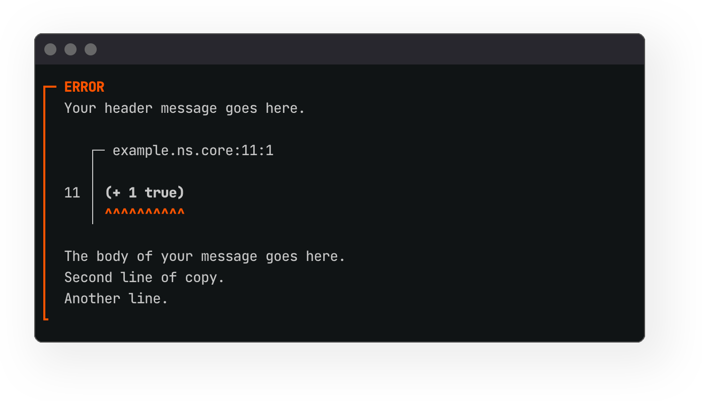</p>

<br>

## Go heavy

If you want to place more emphasis on your callouts you can pass **`get-rich.core/callout`** a `:border-weight` option with a value of `:heavy`. Here is an example using the `example-custom-callout` function we defined above:

```Clojure
(example-custom-callout
 {:file          "example.ns.core"
  :line          11
  :column        1
  :form          '(+ 1 true)
  :type          :error
  :border-weight :heavy})
```

<p align="center">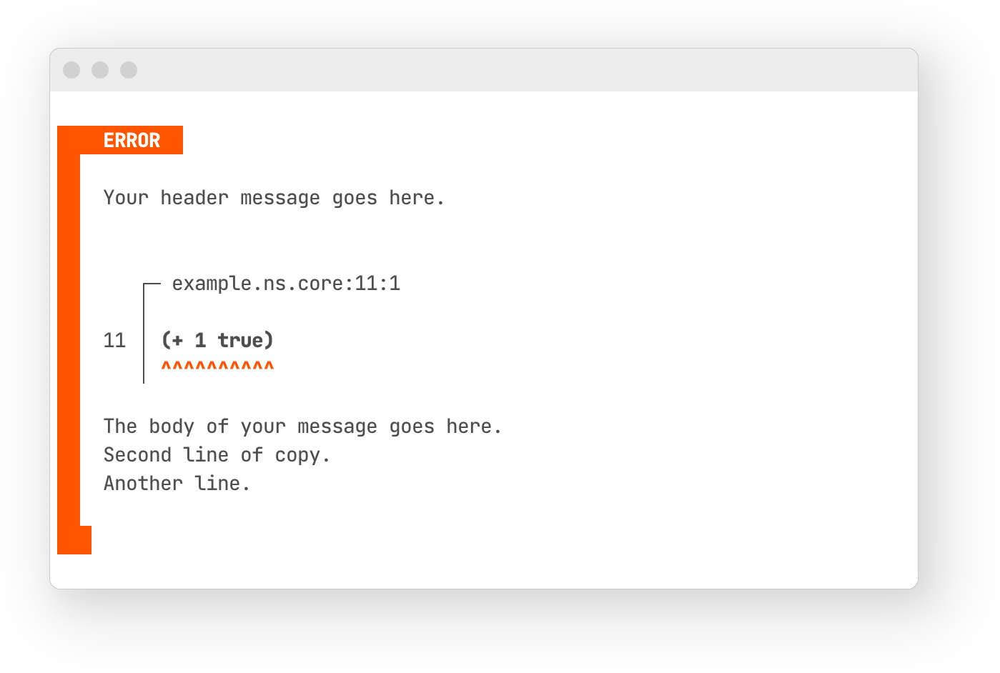</p>

<br>

## Status / Roadmap
Alpha, subject to change. Issues welcome, see [contributing](#contributing).

<br>

## Contributing
Issues for bugs, improvements, or features are very welcome. Please file an
issue for discussion before starting or issuing a PR.


<br>

<!-- ## Alternatives / Prior Art -->

<br>          
